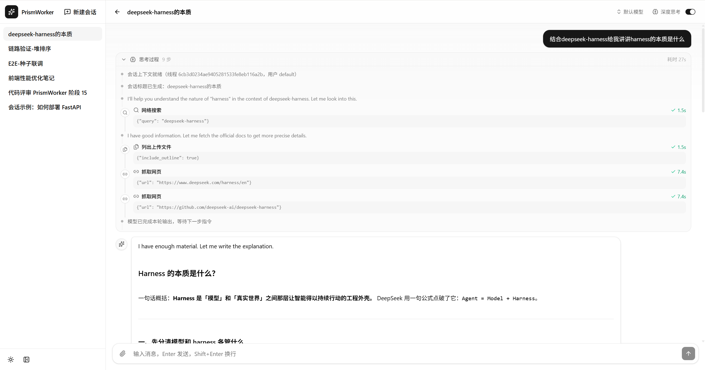

# PrismWorker

面向多步骤复杂任务的 Harness Agent。基于 LangGraph 实现 ReAct 编排，提供子代理协作、跨会话持久记忆、沙盒隔离执行、Skill/Tool 装配与 Middleware 链式上下文治理。拥有文件、代码、图片产物生成能力。



## NextPlan:
    - SSE 连接速度优化
    - 前端 UI 重构 
    - 重构提示词模板管理
    - 用户 agnet.md 支持
    - 支持当前会话使用临时 skill
    - 会话轮次快速索引
    - 树形对话
        - 子卡片：深挖背景知识
        - 关联卡片：横向对比发散
        - 分支卡片：继承上下文另起炉灶
    - 完整日志观测链路
    

## 核心特性

- **ReAct 编排**：LangGraph 驱动，模型每轮「先思考、再行动」，支持多轮工具/Skill 动态装配
- **子代理协作**：主代理可派发子代理并行处理子任务，并统一收拢结果交付
- **跨会话持久记忆**：SQLite 检查点 + 全文/向量检索级记忆，会话可长期延续
- **沙盒隔离执行**：基于 Docker all-in-one-sandbox 隔离执行命令与文件读写，安全可控
- **产物生成**：文件、代码、图片等多形态交付物，支持流式预览与下载
- **Middleware 治理**：链式中间件管理上下文、Token 用量、工具进度与命令安全审计

## 技术栈

| 层 | 技术                                            |
| --- |-----------------------------------------------|
| 编排 | LangGraph / LangChain（Python ≥ 3.12）          |
| 后端 | FastAPI + Uvicorn，SSE 实时事件流                   |
| 模型 | DeepSeek / OpenAI / Anthropic / Google（可插拔）   |
| 记忆 | SQLite + langgraph-checkpoint-sqlite + FTS5   |
| 沙盒 | Docker all-in-one-sandbox                     |
| 前端 | React 19 + TypeScript + Vite + Tailwind CSS 4 |

## 快速开始

```bash
# 1. 后端
python -m venv .venv && .venv\Scripts\activate    # Windows；Linux/macOS 用 source .venv/bin/activate
uv sync                                          # 或 pip install -e .
cp .env.example .env                             # 填入模型 API Key
python -m app.runner                             # http://127.0.0.1:8000

# 2. 前端
cd frontend
pnpm install && pnpm dev                         # http://localhost:5173
```

> 沙盒依赖本机 docker ，首次运行会自动拉取 all-in-one-sandbox 镜像。

## 目录结构

- `app/` —— FastAPI 服务端：API、run 编排、SSE 事件总线
- `harness/` —— Agent 运行时：agents / subagents / middleware / skills / tools / memory / sandbox
- `frontend/` —— React 工作台前端