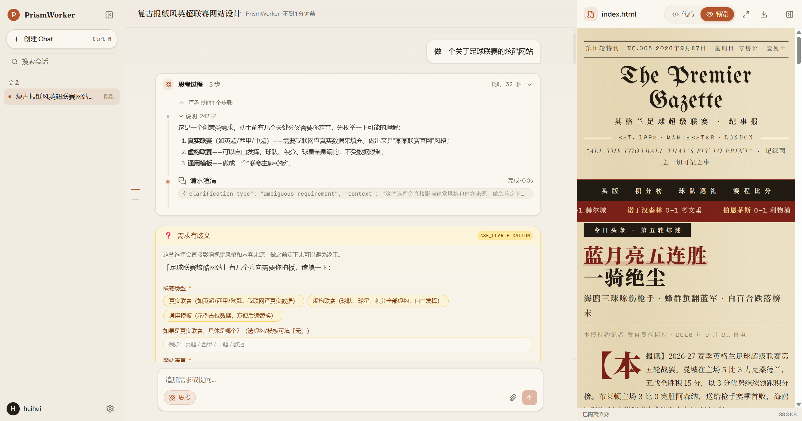

<div align="center">

# PrismWorker
</div>

面向多步骤复杂任务的 Harness Agent。基于 LangGraph 实现 ReAct 编排，提供子代理协作、跨会话持久记忆、沙盒隔离执行、Skill/Tool 装配与 Middleware 链式上下文治理。拥有文件、代码、图片产物生成能力。



## NextPlan

- [x] SSE 连接速度优化
- [x] 前端 UI 重构
- [x] 会话轮次快速索引
- [x] 重构提示词模板管理
- [x] 用户 Agent.md 支持
- [x] 用户上传 skill（私有技能）
- [ ] 树形对话
  - [ ] 子卡片：深挖背景知识
  - [ ] 关联卡片：横向对比发散
  - [ ] 分支卡片：继承上下文另起炉灶
- [ ] 记忆多路检索
- [ ] 完整日志观测链路
- [ ] 完整 langsmith 测评

## 项目结构

```
PrismWorker
├── .prism-worker/        # 运行时数据（自动生成，勿提交版本库）
│   ├── data/             # SQLite 检查点（checkpoints.db）与鉴权密钥
│   ├── logs/             # 运行日志（app.log）
│   ├── users/            # 每用户数据目录
│   │   └── <user_id>/
│   │       ├── agent.md      # 用户自定义指令
│   │       ├── skills/       # 用户上传的 Skill
│   │       └── threads/      # 会话线程数据（uploads / outputs / workspace）
│   └── users.json        # 用户索引
|
├── app/                  # FastAPI 服务端
│   ├── api/              # 路由与请求处理
│   ├── core/             # 鉴权、配置、产物与上传管理
│   └── runner.py         # 启动入口
├── assets/               # 静态资源
|
├── frontend/             # React 前端
│   └── src/              
|
├── harness/              # Agent 运行时
│   ├── agents/           # 主代理编排
│   │   ├── lead_agent/   # Lead Agent（ReAct 主循环与提示词组装）
│   │   └── middlewares/  # 链式中间件治理（agent_md 注入、skill、摘要、澄清、待办、Token 统计等）
│   ├── subagents/        # 子代理协作（内置 general_purpose、task 执行器）
│   ├── prompt/           # 提示词模板库（lead_agent / memory / skills / subagents / summarizer / titler / agent_md）
│   ├── skills/           # Skill 装配（frontmatter 解析、安装、用户技能、review 审查子系统）
│   ├── tools/            # 工具装配（内置：澄清、task、view_image、present_file、技能审查等）
│   ├── memory/           # 跨会话持久记忆
│   ├── sandbox/          # 沙箱
│   ├── models/           # 模型注册与路由（MiMo / OpenAI / DeepSeek）
│   ├── runtime/          # 运行时环境
│   ├── uploads/          # 文件上传管理
│   ├── community/        # 社区扩展工具（tavily_search / web_fetch / ark_image）
│   ├── utils/            # 通用工具
│   └── config/           # 配置加载
└── skills/               # Skill 公开技能
    └── public/           
```

## 技术栈

| 层   | 技术                                            |
|------|-----------------------------------------------|
| 编排 | LangGraph / LangChain（Python ≥ 3.12）          |
| 后端 | FastAPI + Uvicorn，SSE 实时事件流                   |
| 模型 | MiMo / OpenAI / DeepSeek / Doubao-Seedream           |
| 记忆 | SQLite + langgraph-checkpoint-sqlite + FTS5   |
| 沙箱 | Docker                                        |
| 前端 | React 19 + TypeScript + Vite + Tailwind CSS 4 |

## 快速开始

```bash
# 1. 后端
python -m venv .venv && .venv\Scripts\activate    # Windows；Linux/macOS 用 source .venv/bin/activate
uv sync                                          # 或 pip install -e .
cp .env.example .env                             # 填入模型 API Key
python -m app.runner                             # http://127.0.0.1:8000

# 2. 前端
cd frontend
pnpm install && pnpm dev                         # http://localhost:5173
```
